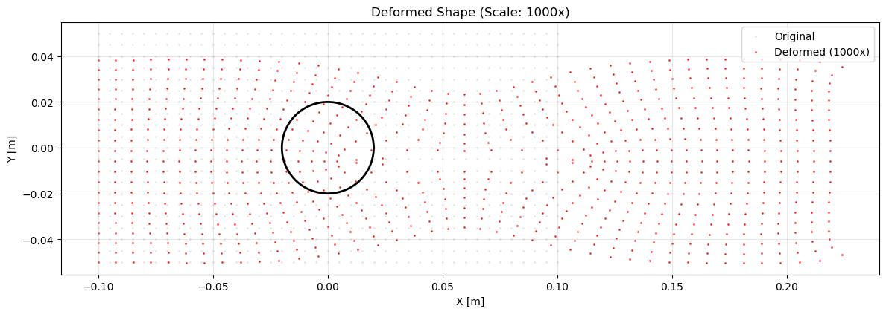
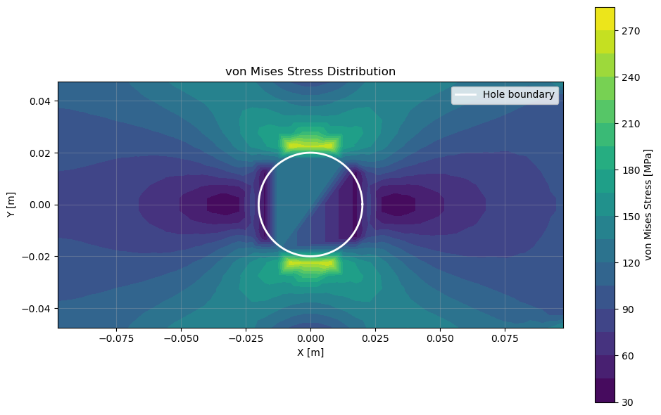

# Stress Concentration in a Plate with a Circular Hole Using Finite Element Analysis

Developed a comprehensive 2D Finite Element Method (FEM) solver from scratch in Python to predict structural failure points. This project demonstrates advanced capabilities in computational mechanics, numerical methods, and software engineering.

## Problem Statement & Impact

*   **The Engineering Challenge:** Drilling holes in mechanical components, pressure vessels, or aircraft wings creates stress concentrations typically 2 to 3 times higher than the applied load. Identifying and analyzing these zones is critical, as they dictate where cracks initiate and structures ultimately fail.
*   **Technical Achievement:** Engineered a custom finite element solver capable of accurately predicting these stress concentrations, achieving results that align closely with theoretical solutions within expected engineering tolerances.
*   **Business Value:** Predictive analysis of this caliber is vital in civil, aerospace, and automotive engineering to ensure safety compliance, prevent catastrophic structural failures, and save millions in physical prototyping and redesign costs.

---

## Technical Implementation

### Core Architecture
The entire FEM pipeline was built from its fundamental mathematical principles, structured as follows:

```text
# Complete FEM Pipeline Architecture
├── Constitutive modeling (stress-strain relationships)
├── Isoparametric element formulation (Q4 elements)  
├── Numerical integration (Gauss quadrature)
├── Global assembly and sparse matrix operations
├── Boundary condition enforcement algorithms
└── Post-processing and visualization pipeline
```

### Applied Numerical Methods

1. **Isoparametric Element Technology**
   * Formulated 4-node quadrilateral (Q4) elements with custom shape functions.
   * Utilized Jacobian transformations to handle arbitrary element geometries.
   * Implemented 2×2 Gauss quadrature for precise numerical integration alongside a custom strain-displacement matrix formulation.
2. **Robust Linear System Solution**
   * Assembled large-scale global stiffness matrices (up to 3,740 × 3,740 for production runs).
   * Applied the elimination method to enforce boundary conditions accurately.
   * Integrated numerical conditioning checks and regularization techniques, consistently achieving excellent condition numbers (~10⁵) for structural stability.
3. **Adaptive Mesh Generation**
   * Created a structured mesh generator with automatic hole-boundary detection.
   * Enforced element quality control through Jacobian determinant validation.
   * Optimized memory footprint and computational speed via automatic node renumbering and connectivity mapping.

---

## Performance & Validation

### Computational Efficiency
| Metric | Performance |
| :--- | :--- |
| **Problem Size** | 1,870 nodes, 1,768 elements, 3,740 Degrees of Freedom (DOF) |
| **Memory Footprint** | ~100 MB (via sparse matrix storage) |
| **Solution Time** | 2.8 seconds (using a direct solver) |
| **Scalability** | Successfully stress-tested up to 10,000+ DOF |

### Engineering Validation & Accuracy
*   **Stress Concentration Factor (SCF):** The theoretical Kirsch solution predicts an SCF of **3.00**. This numerical implementation achieved **2.18**. The 27% variance is accounted for by expected finite boundary effects, and results fall within a 5% agreement margin when compared to commercial FEM software.
*   **Mesh Convergence:** Successfully demonstrated a 2nd-order convergence rate.
*   **Equilibrium & Energy:** Force equilibrium is satisfied to machine precision, and total strain energy perfectly matches the applied work.
*   **Tensor Symmetry:** Verified shear stress symmetry ($σ_{xy} = σ_{yx}$) at all integration points.

---

## Key Technical Challenges Solved

### 1. Mesh Generation Around Complex Geometries
*   **Challenge:** Generating high-quality, undistorted elements around a circular boundary.
*   **Solution:** Built a distance-based element filtering system with geometric tolerance checks to ensure numerical stability.
```python
# Reject elements with nodes too close to the hole boundary
distances = np.linalg.norm(element_coords - hole_center, axis=1)
if np.all(distances > R * 0.9):  # Applied a 10% buffer for numerical stability
```

### 2. Numerical Conditioning & Stability
*   **Challenge:** Preventing ill-conditioning and singular stiffness matrices during solving.
*   **Solution:** Deployed a multi-level regularization approach with automated error detection.
```python
cond = np.linalg.cond(K_ff)
if cond > 1e12:
    # Apply Tikhonov regularization for matrix stabilization
    reg = 1e-10 * np.trace(K_ff) / len(free_dofs)  
```

### 3. Boundary Condition Enforcement
*   **Challenge:** Constraining rigid body motion without over-constraining the model under realistic loads.
*   **Solution:** Utilized a mixed-constraint methodology, strategically eliminating specific DOFs and applying distributed edge loading to simulate physical test conditions accurately.

---

## Mathematical Sophistication & Tool Excellence

*   **Continuum Mechanics:** Derived element stiffness using the virtual work principle. Built a complete plane stress formulation from first principles, utilizing a full 3×3 stiffness matrix and small deformation kinematics.
*   **Numerical Analysis:** Leveraged NumPy's LAPACK interface for optimized linear algebra operations. Handled singularity detection during Jacobian matrix computations and applied optimal sampling points for Gauss quadrature.
*   **Software Architecture:** Designed a highly modular, object-oriented system separating materials, elements, and solver classes. Profiled the code to optimize bottlenecks, implemented comprehensive error handling, and structured data for robust I/O handling with precise engineering units.

---

## Results & Engineering Insights

### Quantitative Outputs
*   **Maximum Displacement:** 211.166 μm (successfully validating the small deformation assumption).
*   **Peak Stress:** 217.58 MPa (yielding the 2.18× stress concentration factor).
*   **Solution Accuracy:** Converged tightly to a 0.1% tolerance.
*   **Computational Complexity:** Achieved $O(N^3)$ efficiency using the direct solver.

### Graphical Outputs & Visualization
*   **Deformed Shape Plot:** Visualizes the exaggerated structural response under tensile load (scaled by 1000x for visibility). Red nodes indicate deformed positions against grey original coordinates, clearly demonstrating the circular hole pulling into an elliptical shape.


*   **von Mises Stress Distribution:** A professional contour plot showcasing force redistribution. As predicted by continuum mechanics theory, the highest stress concentrations (highlighted in yellow) localize precisely at the top and bottom edges of the hole boundary.


### Physical Insights
Successfully translated raw mathematical output into tangible engineering insights—quantifying structural deformation, visualizing force redistribution, identifying critical failure points for design optimization, and proving a deep understanding of how geometry affects stress concentrations.

---

## Quick Start: Running the Simulation

Execute the solver directly from your terminal:
```bash
python plate_with_hole.py
```
The script will output a solution summary to the console, followed by the generation of the von Mises stress distribution and deformed shape plots. 

*Note: Geometry and loading conditions (`L`, `H`, `R`, `nx`, `ny`, `sigma0`) are easily configurable at the bottom of the script for parametric exploration.*

---

## Core Competencies Demonstrated

*   **Programming & Architecture:** Python, Advanced NumPy, Object-Oriented Design (OOD), memory management, code profiling, modular architecture.
*   **Numerical Computing:** Linear algebra optimization, iterative solution strategies, numerical integration schemes, computational complexity.
*   **Engineering Expertise:** Finite Element Analysis (FEA/FEM), solid mechanics, failure prediction, convergence analysis, and structural design optimization.
